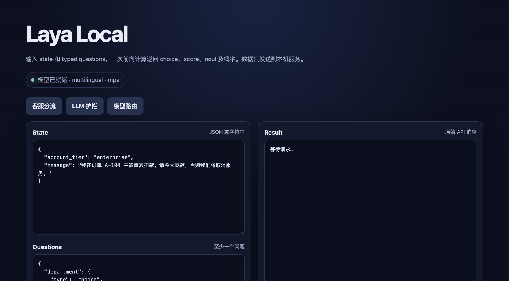
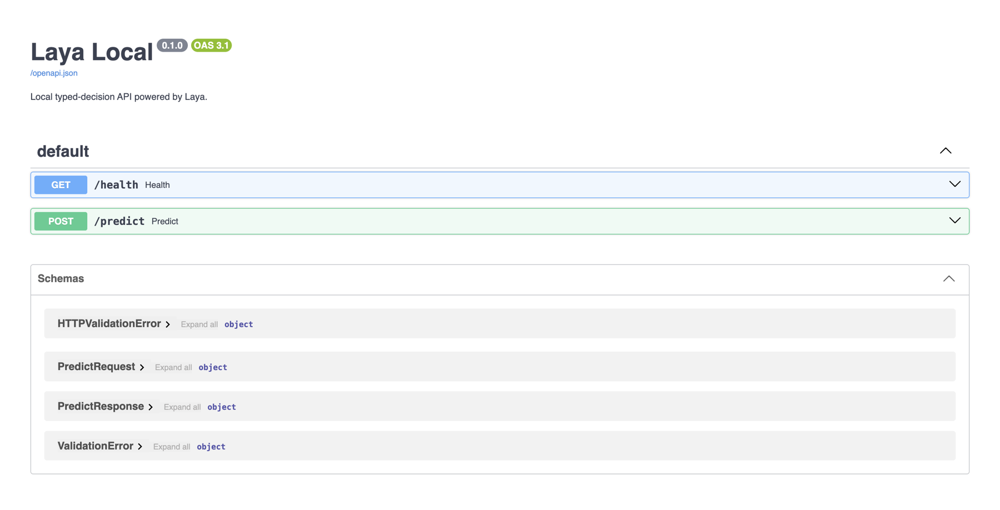
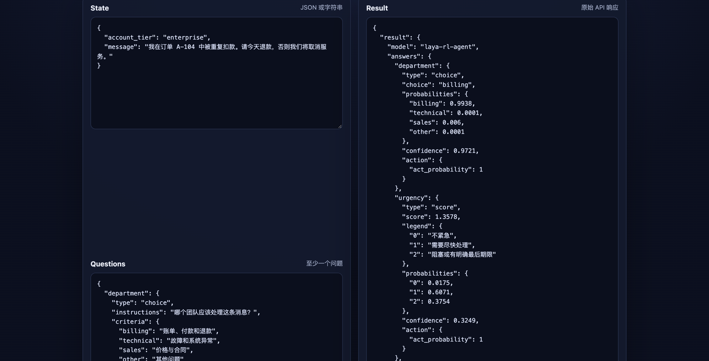

# Laya 非自回归决策服务：本地验证与 Amazon SageMaker AI 部署实践 [SELF HOST "Jev"]

**关键词：** Laya、Jev、typed decision、非自回归模型、FastAPI、Amazon SageMaker AI、模型推理

## 摘要

Laya multilingual checkpoint 可以在 Apple Silicon Mac 上运行，也可以通过 Linux 自定义推理容器部署到 Amazon SageMaker AI `ml.m5.xlarge` 实时端点。它与 Jev 属于同一类 typed-decision 模型，但提供 Apache 2.0 开放权重，可以在企业自己的 AWS 账户中托管。本文给出 FastAPI 封装、容器适配、启动时间、推理结果和 Amazon CloudWatch 指标。

完整代码位于 [koljahuang/laya-local](https://github.com/koljahuang/laya-local)，包含本地 FastAPI 服务、SageMaker 自定义容器和部署验证记录。

## 为什么 typed-decision 模型开始进入基础设施

企业系统里的许多模型调用，其实只需要一个可执行的判断：工具选哪个，工单发给谁，内容要不要拦截，任务该继续还是停止。现在通常由生成式模型返回 JSON，应用再负责解析和校验。这个办法能用，但多走了文本生成这一步，也把格式错误带进了调用链。typed-decision 模型直接返回类型和值，代码可以据此执行规则。

Jev 让这一类模型进入了更多开发者的视野。[Vercel 在 2026 年 9 月 16 日将 Jev 接入 AI Gateway](https://vercel.com/changelog/typesafe-ai-jev-now-available-on-ai-gateway)，用于路由、内容标记和优先级评分。[Cloudflare AI](https://developers.cloudflare.com/ai/models/typesafe/jev/) 提供了 `typesafe/jev` 模型接口；五天后，[LangSmith 上线 Jev evaluator](https://www.langchain.com/blog/jev-is-now-available-in-langsmith-evals)，用于记录 Agent 评估结果。模型网关、边缘云和评估平台都已给出接入方式，这比单纯的发布声明更能说明问题。

| 接入位置 | 典型判断 | 后续动作 |
|---|---|---|
| Agent 编排 | 下一步调用哪个工具或子 Agent | 继续、重试、停止或转人工 |
| 客服与运营 | 部门、紧急度、退款和流失风险 | 分单、排队和升级处理 |
| 安全与护栏 | 内容风险、提示词注入和操作权限 | 阻断、降权或要求审批 |
| 检索与 RAG | 文档是否相关、证据是否充分 | 过滤结果或补充检索 |
| 模型网关 | 当前任务适合哪个模型 | 按成本、速度和能力路由 |
| 评估与监控 | Agent 输出是否符合规则 | 记录评分、告警或加入回归集 |

这类接口也不只服务于 AI 原生产品。企业系统中只要有“模型给出固定答案，代码决定下一步”的环节，就有接入位置。客服、风控、搜索、内容审核和内部自动化都可以复用同一份类型定义，不再针对不同模型编写不同的文本解析逻辑。

它与 MCP 解决的是两段不同的接口。[Anthropic 在 2024 年发布 MCP](https://www.anthropic.com/news/model-context-protocol)，统一 AI 应用连接数据源和工具的方式；typed decision 约束模型交给业务代码的判断结果。Jev 发布后，模型网关、云平台和评估工具相继补上接口，这条扩散路径与 MCP 早期相似。现阶段还没有证据表明两者的采用规模相当。

标题中的 `SELF HOST "Jev"` 指的是功能定位。Laya 没有使用 Jev 权重或 Jev API，但提供同类的 `choice`、`score` 和 `noul` 接口。它的区别在于开放权重，模型和端点可以部署在企业自己的 AWS 账户中。

## Laya 如何表达决策

[Laya](https://huggingface.co/convaiinnovations/laya) 是一个开源的非自回归决策模型。它接收文本、邮件、工单或 JSON 状态，通过三类 typed questions 在一次前向计算中返回结构化结果：

| 问题类型 | 适用场景 | 典型输出 |
|---|---|---|
| `choice` | 部门、意图、路由目标等有限分类 | 选中的类别、各类别概率、置信度 |
| `score` | 紧急程度、难度等有序等级 | 期望分数、各等级概率、置信度 |
| `noul` | 是否退款、是否越狱等真假判断 | 事件成立的概率 |

这里的“非自回归”指输出阶段不逐 token 生成。自回归模型在第 t 步估计 `P(y_t | y_<t, x)`，刚生成的 token 会成为下一步输入；Laya 则通过分类头直接计算选项的 logits 和概率。因此，它不会生成一段需要再次解析的答案。

模型本身仍会分类错误，也会受训练数据偏差影响，输出概率可能失准。Laya 省掉的是文本生成和二次解析，业务风险并没有随之消失。

## 本地服务的组成

本地服务包含四个部分：

1. Laya 0.3.5 与 multilingual checkpoint；
2. FastAPI 提供 `/health` 和 `/predict`；
3. 一个不依赖外部 CDN 的浏览器 Playground；
4. `uv` 管理 Python 3.12、依赖锁文件和启动脚本。

调用链很短：浏览器或客户端提交 `state + questions`，FastAPI 完成请求校验，Laya 在 MPS 或 CPU 上推理，服务返回 JSON。



*图 1：本地 Playground。页面提供客服分流、LLM 护栏和模型路由三个预设。*

## 准备运行环境

本地环境使用配有 16 GB 统一内存的 Apple Silicon Mac。项目依赖要求 Python 版本低于 3.14，因此通过 `uv` 使用 Python 3.12；本次验证环境解析为 3.12.11，具体依赖版本记录在 `uv.lock` 中。

`pyproject.toml` 的核心依赖如下：

```toml
[project]
requires-python = ">=3.11,<3.14"
dependencies = [
  "fastapi>=0.115,<1",
  "laya==0.3.5",
  "uvicorn[standard]>=0.34,<1",
]
```

默认加载 multilingual checkpoint，因为测试输入包含中文：

```bash
export LAYA_MODEL=convaiinnovations/laya
export LAYA_SUBFOLDER=multilingual
export LAYA_DEVICE=auto
export PYTORCH_ENABLE_MPS_FALLBACK=1
```

Laya 会在可用时选择 MPS；若设备不可用或模型迁移失败，则回退到 CPU。`PYTORCH_ENABLE_MPS_FALLBACK=1` 允许个别 MPS 不支持的算子在 CPU 上执行。

首次安装和下载模型：

```bash
cd ~/projects/laya-local
./scripts/setup.sh
```

脚本依次安装 Python 3.12、同步锁定依赖、下载模型，并执行一条中文推理。模型缓存在项目的 `.cache/huggingface`，不会提交到 Git。

## 用 FastAPI 封装 Laya

服务在 FastAPI lifespan 阶段加载模型。这样，应用只有在模型准备完成后才开始接收流量，`/health` 也能返回实际设备和加载耗时。

```python
MODEL_ID = os.getenv("LAYA_MODEL", "convaiinnovations/laya")
SUBFOLDER = os.getenv("LAYA_SUBFOLDER", "multilingual").strip() or None
REQUESTED_DEVICE = os.getenv("LAYA_DEVICE", "auto").strip().lower()


def _load_agent() -> laya.Agent:
    device = None if REQUESTED_DEVICE == "auto" else REQUESTED_DEVICE
    return laya.load(MODEL_ID, subfolder=SUBFOLDER, device=device)
```

推理接口定义了两项必填字段：任意 JSON 或文本形式的 `state`，以及至少包含一个条目的 `questions`。

```python
class PredictRequest(BaseModel):
    state: Any
    questions: dict[str, dict[str, Any]] = Field(min_length=1)


@app.post("/predict")
def predict(payload: PredictRequest) -> PredictResponse:
    started = time.perf_counter()
    with _inference_lock:
        result = _agent.predict(payload.state, payload.questions)

    return PredictResponse(
        result=jsonable_encoder(result),
        latency_ms=round((time.perf_counter() - started) * 1000, 2),
        deployment=_deployment_info(),
    )
```

本地服务固定使用一个 Uvicorn worker，并通过 `threading.Lock` 串行执行推理。每增加一个 worker，就会再加载一份模型；这个演示选择单 worker，是为了避免在 16 GB 统一内存的开发机上保存多个模型副本。生产环境应根据实例内存、吞吐目标和压测结果确定 worker 与副本数量。

FastAPI 自动生成 OpenAPI 文档，便于在浏览器中检查请求和响应结构。



*图 2：FastAPI 自动生成的 OpenAPI 文档。*

## 发起一次 typed-decision 请求

下面的请求同时判断处理部门、紧急程度、流失风险和退款意图：

```json
{
  "state": {
    "account_tier": "enterprise",
    "message": "我在订单 A-104 中被重复扣款。请今天退款，否则我们将取消服务。"
  },
  "questions": {
    "department": {
      "type": "choice",
      "instructions": "哪个团队应该处理这条消息？",
      "criteria": {
        "billing": "账单、付款和退款",
        "technical": "故障和系统异常",
        "sales": "价格与合同",
        "other": "其他问题"
      }
    },
    "urgency": {
      "type": "score",
      "instructions": "这个请求有多紧急？",
      "criteria": ["不紧急", "需要尽快处理", "阻塞或有明确最后期限"]
    },
    "churn_risk": {
      "type": "noul",
      "instructions": "客户是否威胁取消服务或离开？"
    },
    "refund_requested": {
      "type": "noul",
      "instructions": "客户是否明确要求退款？"
    }
  }
}
```

示例请求返回 `billing`，类别概率为 0.9938，接口耗时为 377.59 ms。图 3 展示了 `choice` 与 `score` 的原始返回结构。



*图 3：推理结果包含选项概率、置信度和分数，不包含生成文本。*

> **测试说明：** 上述数字来自单机单次样例，只用于确认调用链可工作，不是性能基准。延迟会随硬件、冷启动、问题数量、输入长度和 checkpoint 改变。

### 演示视频

下面的视频展示了切换预设、执行推理和查看 OpenAPI 文档的过程。

<video controls width="100%" poster="assets/02-playground-result.png" src="assets/laya-playground-demo.mp4"></video>

*视频 1：Laya Playground 本地操作演示，13.4 秒，1280×720，H.264。*

## 在 Amazon SageMaker AI 上完成部署验证

FastAPI 服务按 Amazon SageMaker AI 自定义推理容器协议进行适配。根据 [Amazon SageMaker AI 自定义推理容器文档](https://docs.aws.amazon.com/sagemaker/latest/dg/adapt-inference-container.html)，容器监听 8080 端口，并提供 `/ping` 与 `/invocations` 接口。

镜像使用 Linux `amd64`、Python 3.12、CPU 版 PyTorch 2.14 和 Laya 0.3.5。multilingual checkpoint 固定在 `/opt/ml/model`，容器启动时不访问 Hugging Face。这样验证起来省事，代价是镜像较大：本地约 1.92 GB，推送到 Amazon Elastic Container Registry（Amazon ECR）后约 963 MB。

部署配置如下：

| 项目 | 配置或结果 |
|---|---|
| AWS 区域 | `us-west-2` |
| 实例 | `ml.m5.xlarge`，1 个副本 |
| 推理设备 | CPU |
| 容器接口 | `GET /ping`、`POST /invocations` |
| 模型加载时间 | 28.154 秒，取自容器日志 |
| Endpoint 创建到 `InService` | 约 184 秒 |
| 调用次数 | 3 次，均返回 HTTP 200 |
| 容器记录的处理耗时 | 428.99、421.94、427.02 ms，平均约 425.98 ms |
| CloudWatch `ModelLatency` | 436.55 ms |
| CloudWatch `OverheadLatency` | 228.28 ms |

创建流程包括：

1. 构建并在本地验证 `linux/amd64` 镜像；
2. 创建 Amazon ECR 仓库和 SageMaker AI 执行角色；
3. 推送镜像并创建 Model、Endpoint Configuration 和实时 Endpoint；
4. 等待 Endpoint 进入 `InService`；
5. 使用相同的中文请求调用 Endpoint 三次；
6. 检查 CloudWatch 日志与指标。

三次调用返回完全一致的结构化判断：`department=billing`，对应概率 0.9938；`urgency=1.3578`；`churn_risk=0.0654`；`refund_requested=0.9945`。这一结果只能说明容器与托管调用链工作正常，不能替代业务数据集评估。

本地通过 AWS CLI 观察到的端到端耗时为 2.09–2.96 秒，其中包含本地 CLI 启动、凭证解析、网络和服务端处理，不应与模型计算时间直接比较。`ModelLatency` 更适合观察模型容器的响应时间；`OverheadLatency` 反映 SageMaker AI 在容器外增加的处理时间。指标定义见 [Amazon SageMaker AI 的 CloudWatch 指标文档](https://docs.aws.amazon.com/sagemaker/latest/dg/monitoring-cloudwatch.html)。

CloudWatch 日志显示，模型用 28.154 秒加载完成。此后的 `/ping` 健康检查持续返回 200，三次 `/invocations` 也都成功，日志中没有容器异常。查询时，CloudWatch 已经产生 `Invocations`、`ModelLatency` 和 `OverheadLatency` 数据点。指标发布有延迟，当时读取的最新窗口还没有汇总日志中的全部三次调用。

checkpoint 直接放在镜像里，没有另建 Amazon Simple Storage Service（Amazon S3）模型工件。生产部署时可以把模型单独存入 Amazon S3，减小镜像，并分别管理代码和模型版本。根据 [AWS 实时推理端点文档](https://docs.aws.amazon.com/sagemaker/latest/dg/realtime-endpoints-deploy-models.html)，部署前需要准备自定义镜像的 Amazon ECR URI、模型工件位置（如使用）和 IAM 角色。

## 为什么把 Laya 部署到 SageMaker AI

Laya 在普通 Python 进程里就能运行。SageMaker AI 负责端点生命周期、监控、版本配置和访问权限，省去了自行维护推理服务器的部分工作。

### 减少端点基础设施运维

在本地需要自己管理进程、端口、健康检查和重启逻辑。部署后，SageMaker AI 持续调用 `/ping` 判断容器状态，并在模型就绪后把 Endpoint 切换到 `InService`。团队仍需维护镜像和推理代码，但不必自行搭建实时端点的实例生命周期与健康检查控制面。

对于流量变化较大的场景，[SageMaker AI 实时端点文档](https://docs.aws.amazon.com/sagemaker/latest/dg/realtime-endpoints-deploy-models.html)支持在 Endpoint Configuration 中设置生产变体，并为推理组件启用托管实例扩缩。Laya 的请求格式固定，适合通过增加副本横向扩展；每个副本内部仍应根据内存和压测结果控制 worker 数量。

### 把模型耗时和平台开销分开观察

本地服务记录的 `latency_ms` 只覆盖等待推理锁和调用模型的时间。SageMaker AI 在 CloudWatch 中提供 `ModelLatency` 与 `OverheadLatency`：前者反映模型容器响应调用所需的时间，后者反映容器外的平台处理时间。该端点记录的两个数值分别为 436.55 ms 和 228.28 ms，比单独记录客户端总耗时更方便排查问题。

CloudWatch Logs 会记录模型加载、健康检查和调用信息。日志中的模型加载时间为 28.154 秒，三次 `/invocations` 均返回 200。

### 固定并追踪部署版本

自定义容器存放在 Amazon ECR，再由 SageMaker AI Model 和 Endpoint Configuration 引用。生产环境可以把 Model 的镜像 URI 固定到 ECR image digest，并记录模型配置、实例类型和副本数。需要复现或回退时，就不必再猜服务器当时装了哪些依赖。

当前方案将 checkpoint 放进镜像。生产环境也可以把模型工件放在 Amazon S3，分别管理代码镜像和模型版本。具体方式取决于模型大小、启动时间、发布频率和合规要求。

### 接入 AWS 的权限和网络控制

SageMaker AI Model 使用 IAM 执行角色访问获准资源。实时端点还可以配置 Amazon Virtual Private Cloud（Amazon VPC）和容器网络隔离。这样，包含客户邮件、工单或安全告警的请求可以沿用现有的身份、网络和审计规则，不必直接暴露一个没有认证的 FastAPI 地址。

### 给调用方提供统一接口

应用通过 SageMaker Runtime `InvokeEndpoint` 提交 JSON 即可。调用方不用关心模型运行在哪台机器，也不用管理 Python、PyTorch 和 checkpoint 缓存。底层从 CPU 切换到 GPU、调整副本数或更新镜像时，请求契约可以保持不变。多个系统共用路由、审核或分类服务时，也不必跟着底层部署一起改代码。

实时端点按运行时间计费，调用量低时容易闲置；963 MB 的压缩镜像和 28 秒模型加载会拖慢发布与扩容。CloudWatch 记录的 `OverheadLatency` 为 228.28 ms，低延迟场景不能忽略。选型时应在同一组流量和成本假设下比较 SageMaker AI、Amazon EC2、容器服务、异步推理和批处理，不能因为“托管”两个字就默认使用实时端点。

## 上线前需要完成的工作

当前部署已经验证模型加载、请求校验、容器协议和托管调用链。生产上线前还需要补齐以下内容：

- 用真实业务样本建立离线评估集，分别评估 `choice`、`score` 和 `noul`；
- 根据误判成本选择自动化阈值，并在需要时转人工；
- 对概率做校准检查，而不是直接把高置信度当作正确；
- 固定 Hugging Face model revision 和基础镜像 digest，并为模型版本、问题定义和业务阈值建立变更记录；
- 在目标实例上压测内存、并发、冷启动和批量问题延迟；
- 使用 IAM、私有网络、加密和日志脱敏保护输入数据。

Laya 的模型卡列出了具体限制。基础 checkpoint 在特定 typed-decisions 任务上的零样本能力有限，`score` 的表现相对较弱；`choice` 选项过多时，还会挤压选项 token 预算。正式采用前，需要用自己的数据和问题定义重新验证。

## 总结

同一个 Laya checkpoint 和 `state + questions` 请求契约，已经分别通过本地 FastAPI 适配器运行在 Apple Silicon MPS 上，也通过 SageMaker AI 容器适配器运行在 `ml.m5.xlarge` CPU 上。容器协议、Amazon ECR、健康检查和 CloudWatch 监控均已验证。

三次成功调用只能确认部署链路可用，无法回答准确率、并发和成本问题。生产上线前仍需使用业务样本检查概率校准，在目标实例上压测，并确定自动处理阈值和人工兜底规则。

## 参考资料

1. [Laya 模型页](https://huggingface.co/convaiinnovations/laya)
2. [Laya GitHub 项目](https://github.com/NandhaKishorM/laya)
3. [Introducing System One Models & Jev](https://typesafe.ai/blog/introducing-system-one-models-and-jev)
4. [TypeSafe AI's Jev now available on Vercel AI Gateway](https://vercel.com/changelog/typesafe-ai-jev-now-available-on-ai-gateway)
5. [Jev on Cloudflare AI](https://developers.cloudflare.com/ai/models/typesafe/jev/)
6. [Jev is now available in LangSmith Evals](https://www.langchain.com/blog/jev-is-now-available-in-langsmith-evals)
7. [Introducing the Model Context Protocol](https://www.anthropic.com/news/model-context-protocol)
8. [Adapt your own inference container for Amazon SageMaker AI](https://docs.aws.amazon.com/sagemaker/latest/dg/adapt-inference-container.html)
9. [Deploy models for real-time inference](https://docs.aws.amazon.com/sagemaker/latest/dg/realtime-endpoints-deploy-models.html)
10. [Amazon SageMaker AI metrics in Amazon CloudWatch](https://docs.aws.amazon.com/sagemaker/latest/dg/monitoring-cloudwatch.html)
